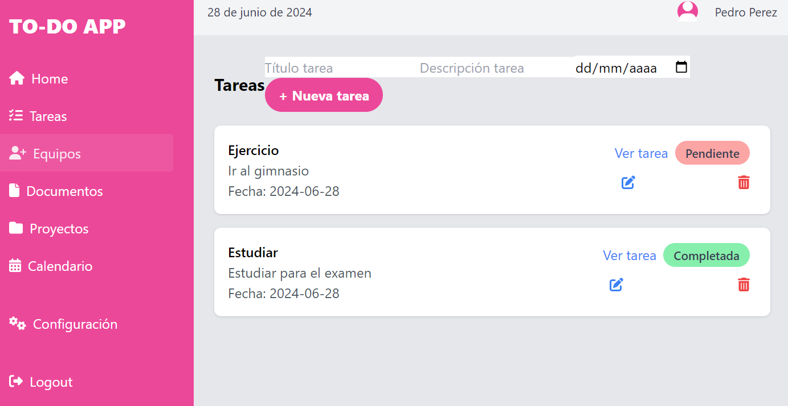
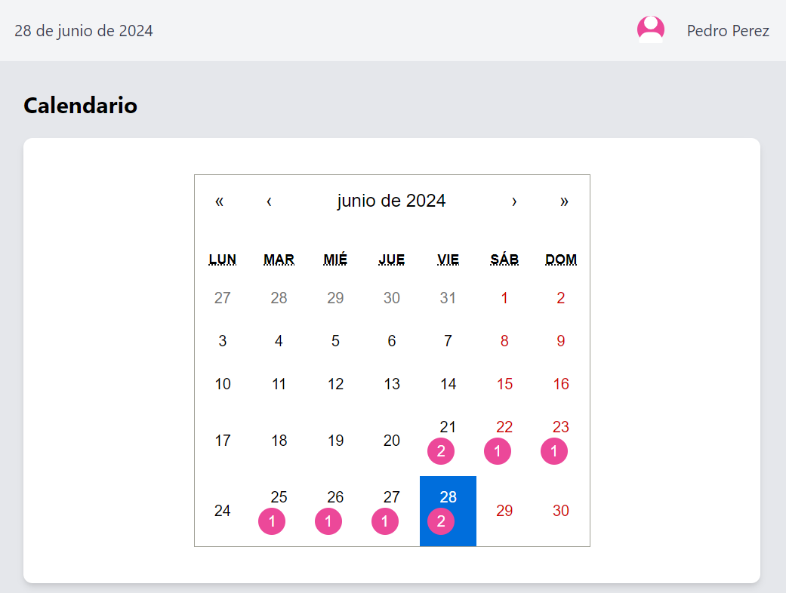
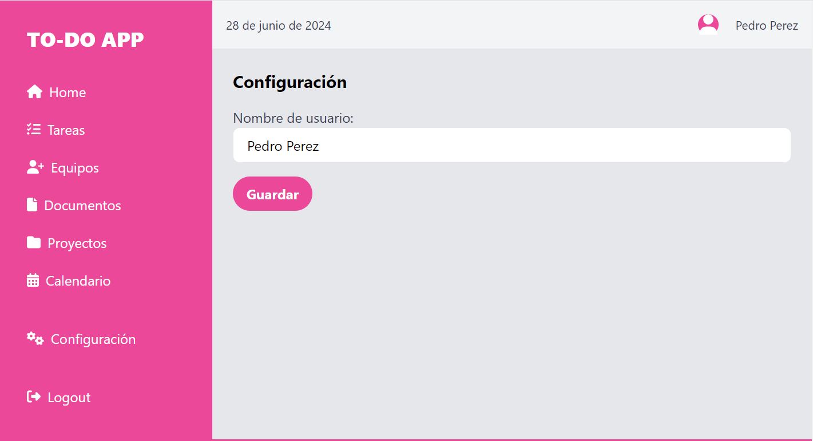

# Aplicación de Lista de Tareas - TO-DO APP

## Descripción General 📊

La Aplicación de Lista de Tareas es una herramienta diseñada para facilitar la gestión y seguimiento de las tareas diarias de los usuarios. Proporciona una interfaz clara y fácil de usar, que permite a los usuarios organizar su carga de trabajo de manera eficiente y efectiva.

## Tecnologías Utilizadas 🛠️

Hasta ahora, hemos implementado las siguientes tecnologías:

- **HTML**: Estructura semántica de la página web.
- **CSS**: Estilos visuales para proporcionar una experiencia de usuario atractiva y responsiva.
- **Tailwind CSS**: Framework de CSS para estilos rápidos y coherentes con el diseño.
- **JavaScript**: Funciones de interactividad en el lado del cliente para manejar eventos y modificar el DOM.
- **React**: Framework de JavaScript para construir interfaces de usuario interactivas y manejar el estado de la aplicación.
- **Node.js y Express**: Servidor backend para manejar solicitudes y persistencia de datos.
- **MySQL - MariaDB**: Base de datos para almacenar las tareas de forma segura y eficiente.

## Características Actuales ✅

- Desarrollo de una **barra lateral estética** con navegación intuitiva.
- Creación de una **cabecera informativa** que muestra fecha y usuario.
- Diseño de un **sistema de tarjetas de tareas** para representar visualmente las tareas pendientes y completadas.
- Autenticación de usuarios con **JSON Web Tokens (JWT)**.
- **CRUD de tareas**: Crear, leer, actualizar y eliminar tareas.
- **CRUD de usuarios**: Crear, leer, actualizar y eliminar datos de usuarios.
- **Integración de un calendario**: Visualiza tus eventos y tareas en un formato de calendario.

### Capturas de Pantalla

#### Vista de Tareas

#### Calendario de Tareas

#### Edición datos usuario

## Planificación Futura 🚀

Algunas futuras mejoras podrían ser:

- **Mejoras en la UI/UX**: Refinar el diseño y la usabilidad de la aplicación.
- **Notificaciones y recordatorios**: Alertas para recordar a los usuarios sobre sus tareas pendientes.
- **Colaboración en equipo**: Permitir a los usuarios compartir tareas y proyectos con otros usuarios.
- **Informes y análisis**: Herramientas para analizar la productividad y el progreso.
- **Pruebas unitarias y de integración**: Implementar Jest y React Testing Library para asegurar la calidad del código.
- **Perfil de Administrador**: Crear, leer, actualizar y eliminar usuarios y tareas con permisos de administrador.

## Cómo Contribuir 🤝

Valoramos tus contribuciones para hacer de esta herramienta algo aún más útil. Puedes contribuir de la siguiente manera:

1. **Realiza un fork del repositorio.**
2. **Crea una nueva rama para tus mejoras:** `git checkout -b feature/MiMejora`.
3. **Realiza tus cambios y haz commit:** `git commit -m 'Añadir MiMejora'`.
4. **Sube tus cambios y crea un Pull Request.**

## Licencia 📃

Este proyecto está bajo la Licencia MIT.

---

Hecho con ❤️ por [CarPeAs](https://github.com/CarPeAs) 
